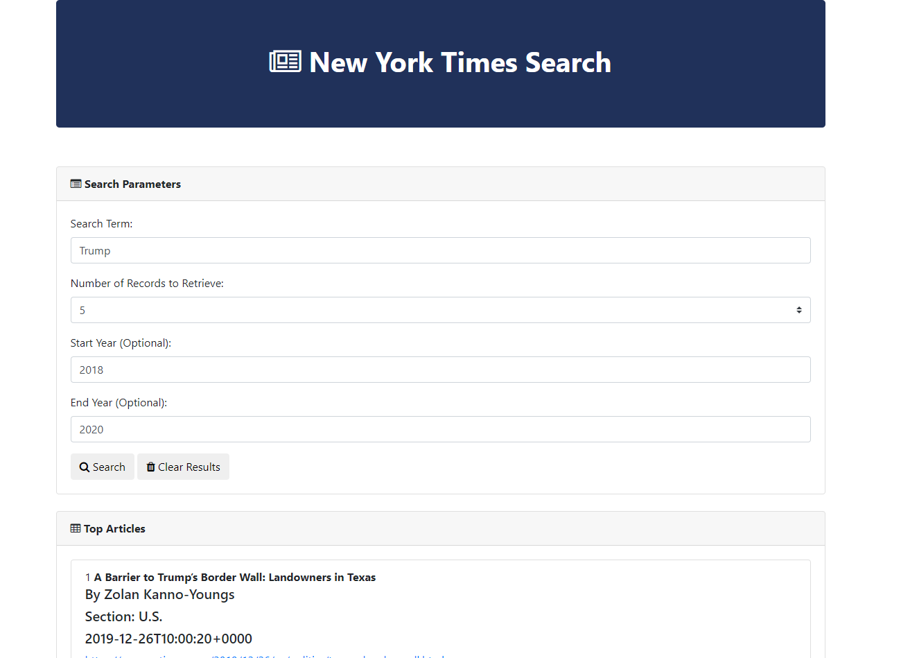

# NYT_Search
A solved version of a NYT search done by class instructors with comments in the code for me to study.  I did this on my own following an instructional video but i like the user interface of this one so I want to study it and learn.  I just set this up with my own api key so it wouldnt interfere with the class version.

## Screenshot

